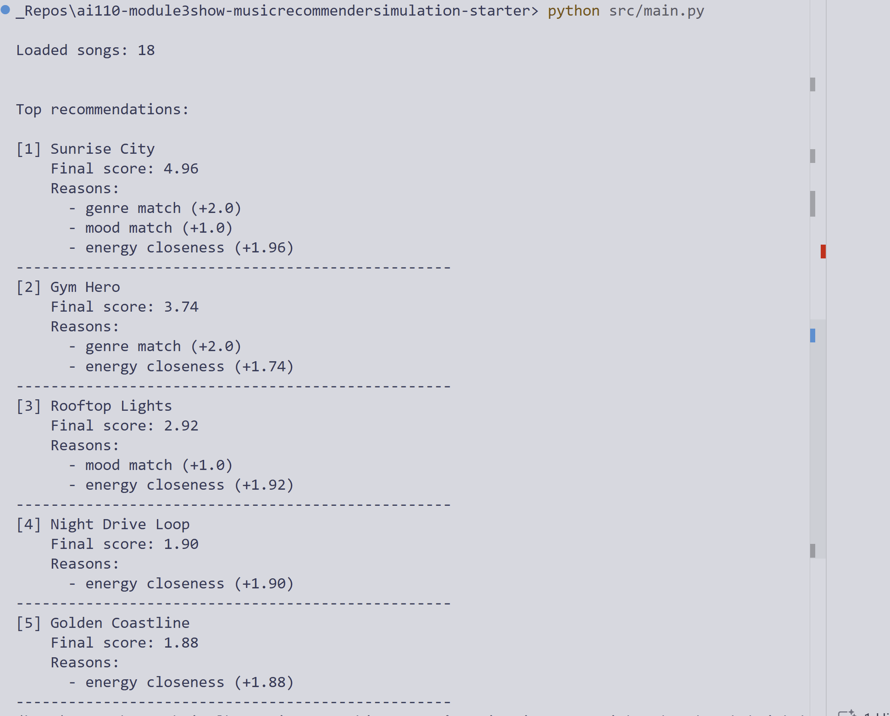
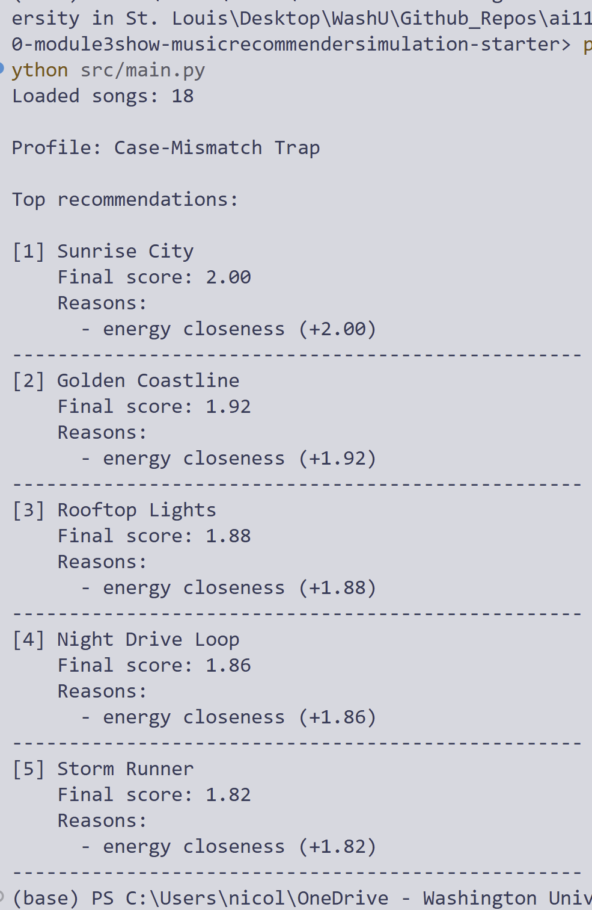

# Music Recommender Simulation

A transparent, rules-based music recommender built to demonstrate how user preferences are converted into ranked song suggestions.

## Portfolio Snapshot

This project simulates the core logic behind recommendation systems using a small, interpretable pipeline:

- User preferences are represented as structured inputs (genre, mood, target energy).
- Each song is scored with explicit weighting rules.
- Top-k songs are returned with human-readable explanations for why they ranked highly.

Instead of maximizing model complexity, this project prioritizes explainability, testing, and critical reflection on bias and limitations.

## Why This Project Matters

Recommendation systems power major platforms (Spotify, YouTube, TikTok, Netflix), but their ranking logic is often opaque. This simulation makes ranking behavior auditable and easy to reason about.

It is useful as a learning artifact for:

- ML/AI fundamentals
- Feature engineering tradeoffs
- Scoring and ranking design
- Failure modes and fairness discussions

## System Design

### Inputs

Song features used:

- genre
- mood
- energy
- tempo_bpm
- valence
- danceability
- acousticness

User profile fields used in scoring:

- genre
- mood
- energy

### Scoring Logic

Each song receives a total score from three components:

- +2.0 for exact genre match
- +1.0 for exact mood match
- +0.0 to +2.0 for energy closeness

Energy closeness is computed with a capped distance penalty:

score_energy = 2.0 x (1.0 - min(abs(song_energy - target_energy), 1.0))

Songs are then sorted by final score in descending order, and the top k are returned.

### Recommendation Flow

1. Load songs from CSV.
2. For each song, compute weighted score and explanation reasons.
3. Rank songs by score.
4. Return top-k recommendations.

## Example Outputs

Formatted recommendation output:



Adversarial and edge-case output:



## Tech Stack

- Python
- pytest
- pandas (available in environment)
- streamlit (available in environment)

## Project Structure

- data/songs.csv: song catalog (18 tracks)
- src/recommender.py: loading, scoring, and ranking logic
- src/main.py: command-line runner with multiple test profiles
- tests/test_recommender.py: starter unit tests
- model_card.md: model card with strengths, limitations, and risks

## Reproducibility

### 1) Clone and enter the project

Use your preferred Git workflow to clone this repository and open it in VS Code.

### 2) Create and activate a virtual environment

Windows PowerShell:

```powershell
python -m venv .venv
.venv\Scripts\Activate.ps1
```

Mac/Linux:

```bash
python -m venv .venv
source .venv/bin/activate
```

### 3) Install dependencies

```bash
pip install -r requirements.txt
```

### 4) Run the recommender

```bash
python -m src.main
```

### 5) Run tests

```bash
pytest
```

## Evaluation Highlights

Profiles tested in src/main.py include:

- High-Energy Pop
- Chill Lofi
- Deep Intense Rock
- Case-Mismatch Trap
- Out-of-Range Energy

Key observations:

- Exact string matching makes results sensitive to input formatting (for example, Pop vs pop).
- Extreme energy inputs can flatten separation in energy-based scoring.
- Heavy genre/mood weights can produce filter-bubble behavior.

## Limitations

- Small dataset size (18 songs) limits realism.
- Exact matching on text fields reduces robustness.
- Single-profile assumptions do not capture evolving or multi-interest taste.
- No diversity constraint in ranking.

## Roadmap

Potential next improvements:

- Normalize user inputs (case, whitespace, spelling variants).
- Add acousticness and valence weighting from user profile.
- Add ranking diversity constraints to reduce near-duplicate results.
- Evaluate with a larger and more representative catalog.
- Build a lightweight Streamlit UI for interactive experimentation.

## Responsible AI Notes

This system is educational, not production-grade. It should not be used for real user-facing recommendations without significant improvements in data coverage, robustness, and bias evaluation.

See the model card for deeper analysis:

- [Model Card](model_card.md)

## Author Notes

This repository is designed as a learning-focused AI engineering artifact and can be presented as:

- A recommendation-system fundamentals project
- An interpretable ranking pipeline case study
- A bias and evaluation reflection exercise
